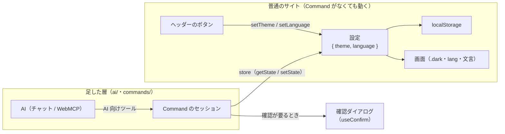

# テーマ・言語の切り替えサイト

テーマ（ライト / ダーク / システム）と言語（日本語 / English）を切り替えるだけの、一般的なサイト。普通の React のサイトに Command の層を足し、AI からも同じ設定を変えられるようにしている。

## しくみ



* 画面のボタンは、普通のサイトと同じく `setTheme` / `setLanguage` を呼ぶ。Command は通らない
* AI の操作は Command を通る。セッションは `store` でサイトの設定を読み、結果を `setTheme` / `setLanguage` に書き込む
* 複数の Command（「英語にしてダークにして」）は 1 回の実行（バッチ）にまとめられ、1 つでも失敗したら何も変えない
* 確認が要る Command（`reset_settings`）は、サイトの確認ダイアログ（`useConfirm`）で承認を得てから実行する
* `app.tsx` から `<Ai />` を外しても、サイトはそのまま動く（AI から操作できなくなるだけ）

## Command

| Command | 引数 | 内容 | AI が実行するとき |
| --- | --- | --- | --- |
| `set_theme` | `theme: "light" \| "dark" \| "system"` | テーマを変える。`system` は OS の設定に追従する | そのまま実行 |
| `set_language` | `language: "ja" \| "en"` | 表示の言語を変える | そのまま実行 |
| `reset_settings` | なし | テーマと言語を初期値に戻す。画面にボタンはなく、AI からだけ実行する | 確認ダイアログを出す |

定義は `src/commands/settings-commands.ts`。1 つの Command は次のように書く:

```ts
export const setTheme = defineCommand({
  type: "set_theme",
  description: 'Change the color theme. "system" follows the OS setting.', // AI 向けの説明
  args: z.object({ theme: z.enum(themes) }), // 引数（zod）。AI からの入力もここで検証される
  apply(state: Settings, args) {
    return { ok: true, state: { ...state, theme: args.theme } };
  },
});
```

## 設定

```ts
type Settings = {
  theme: "light" | "dark" | "system";
  language: "ja" | "en";
};
```

* 初期値は `theme: "system"`、`language` はブラウザの言語（`ja` で始まれば `ja`、それ以外は `en`）
* localStorage（`ai-friendly:settings`）に保存する。読み込むときに検証し、壊れていれば初期値に戻す

## コードの構成

「普通のサイト」と「足した AI の層（`ai/`・`commands/`）」をフォルダで分けている。普通のサイトの側は、AI の層も `@ai-friendly/command` も参照しない。

```
src/
  main.tsx              # 描画だけ
  app.tsx               # SettingsProvider > ConfirmProvider > レイアウト + ページ、<Ai />
  layout/               # 全ページ共通の画面（ヘッダー・切り替えボタン）
  pages/home/           # ページごとの画面。ページ専用の部品もこの下に置く
  settings/             # 表示の設定（状態・保存・<html> への反映・useTheme）
  i18n/                 # 文言の辞書と useI18n
  confirm/              # 確認ダイアログ（useConfirm）
  commands/             # AI が実行できる Command（機能ごとにファイル）
  ai/                   # <Ai />: Command をサイトにつなぎ、AI 向けツールを登録する
```

| ファイル | 役割 |
| --- | --- |
| `settings/settings.ts` | 設定の型・初期値・検証（zod） |
| `settings/settings-provider.tsx` | 設定を `useState` で持ち、localStorage に保存し、テーマ（`.dark`）と言語（`lang`・`<title>`）を `<html>` に反映する |
| `settings/use-theme.ts` / `i18n/use-i18n.ts` | 画面から使うフック（`{ theme, setTheme }` / `{ language, setLanguage, t }`） |
| `i18n/messages.ts` | 文言の辞書（ja / en）。日本語のキーから型を作り、英語の訳し忘れを型エラーにする |
| `i18n/language-names.ts` | 言語名（JA / 日本語）。表示中の言語に関係なくその言語で書くので、辞書に入れない |
| `confirm/confirm-provider.tsx` / `use-confirm.ts` | `await confirm({ title, description, confirmLabel })` で確認ダイアログを出し、承認されたら `true`。文言は辞書のキーで渡す |
| `commands/settings-commands.ts` | 設定の Command |
| `commands/site-commands.ts` | AI が扱う状態の型と、サイト全体の Command を集める（今は設定だけ） |
| `ai/use-site-store.ts` | `useTheme` / `useI18n` の値と setter を、セッションが読み書きできる `store` にする |
| `ai/ai.tsx` | `<Ai />`。セッションを作り、確認を `useConfirm` につなぎ、AI 向けツールを WebMCP に登録する。描画はしない |

* 機能やページを増やすときは、まず普通のサイトとして作る。AI から操作したいものだけ、Command を `commands/` に足し、`ai/use-site-store.ts` でその状態と setter をつなぐ
* `store.setState` は、React の再描画を待たずに次の `getState` が新しい状態を返すようにしている（続けて届いた AI のバッチが古い状態から始まらないように）
* 確認待ちの間に次の確認が来たら、前のものは拒否する

## AI から操作する

AI 向けツールは 3 種類ある。

| ツール | 内容 |
| --- | --- |
| `execute_commands` | 複数の Command を 1 回で実行する |
| `set_theme` / `set_language` / `reset_settings` | Command を 1 つ実行する |
| `get_state` | 今の設定を返す |

* WebMCP が使えるブラウザでは、起動時にこれらを登録する
* 開発中（`bun run dev`）は、devtools のコンソールで `window.__aiTools` から同じツールを呼べる

```js
await window.__aiTools.batch.execute({
  commands: [
    { type: "set_language", language: "en" },
    { type: "set_theme", theme: "dark" },
  ],
});
```

## 画面

* ヘッダー: サイト名、言語（JA / EN）とテーマの切り替え。選択中は黄の地と枠線
* 本文は見出しと 1 文だけ
* 400px より狭い画面では、サイト名を隠してロゴだけにする
