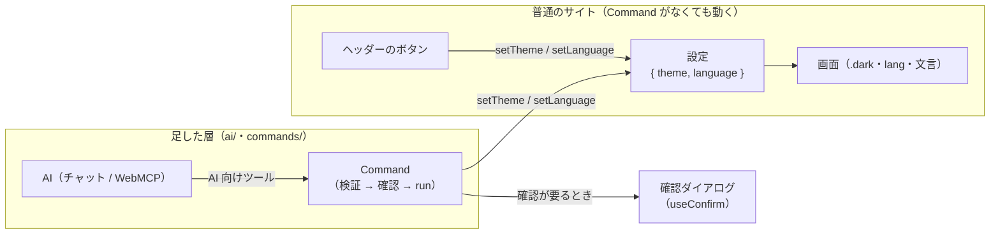

# テーマ・言語の切り替えサイト

テーマ（ライト / ダーク / システム）と言語（日本語 / English）を切り替えるだけの、一般的なサイト。普通の React のサイトに AI の層を足し、AI からもサイトの関数（`setTheme` / `setLanguage`）で設定を変えられるようにしている。

## しくみ



* 画面のボタンは、普通のサイトと同じく `setTheme` / `setLanguage` を呼ぶ。Command は通らない
* AI の操作は Command を通る。Command は引数を検証し、ボタンと同じ `setTheme` / `setLanguage` を呼ぶ
* 状態が変わるたびに、Command と AI 向けツールを作り直して登録し直す（`get_state` が今の設定を返すように）
* 確認が要る Command（`reset_settings`）は、サイトの確認ダイアログ（`useConfirm`）で承認を得てから実行する
* `app.tsx` から `<Ai />` を外しても、サイトはそのまま動く（チャットがなくなり、AI から操作できなくなるだけ）

## Command

| Command | 引数 | 内容 | AI が実行するとき |
| --- | --- | --- | --- |
| `set_theme` | `theme: "light" \| "dark"` | テーマを変える | そのまま実行 |
| `set_language` | `language: "ja" \| "en"` | 表示の言語を変える | そのまま実行 |
| `reset_settings` | なし | テーマと言語を初期値に戻す。画面にボタンはなく、AI からだけ実行する | 確認ダイアログを出す |

定義は `src/commands/settings-commands.ts`。1 つの Command は、サイトの関数を包むだけ:

```ts
defineCommand({
  type: "set_theme",
  description: "Change the color theme.", // AI 向けの説明
  args: z.object({ theme: z.enum(themes) }), // 引数（zod）。AI からの入力はここで検証される
  run: ({ theme }) => setTheme(theme), // ボタンと同じ setter を呼ぶ
}),
```

## 設定

```ts
type Settings = {
  theme: "light" | "dark";
  language: "ja" | "en";
};
```

* 初期値は `theme: "light"`、`language: "ja"`
* 保存はしない。再読み込みすると初期値に戻る

## コードの構成

「普通のサイト」と「足した AI の層（`ai/`・`commands/`）」をフォルダで分けている。普通のサイトの側は、AI の層も `@ai-friendly/command` も参照しない。

```
src/
  main.tsx              # 描画だけ
  app.tsx               # SettingsProvider > ConfirmProvider > レイアウト + ページ、<Ai />
  layout/               # 全ページ共通の画面（ヘッダー・切り替えボタン）
  pages/home/           # ページごとの画面。ページ専用の部品もこの下に置く
  settings/             # 表示の設定（状態・<html> への反映・useTheme）
  i18n/                 # 文言の辞書と useI18n
  confirm/              # 確認ダイアログ（useConfirm）
  commands/             # AI が実行できる Command（機能ごとにファイル）
  ai/                   # <Ai />: Command を AI 向けツールにし、チャットと WebMCP から使えるようにする
```

| ファイル | 役割 |
| --- | --- |
| `settings/settings.ts` | 設定の型と初期値 |
| `settings/settings-provider.tsx` | 設定を `useState` で持ち、テーマ（`.dark`）と言語（`lang`・`<title>`）を `<html>` に反映する |
| `settings/use-theme.ts` / `i18n/use-i18n.ts` | 画面から使うフック（`{ theme, setTheme }` / `{ language, setLanguage, t }`） |
| `i18n/messages.ts` | 文言の辞書（ja / en）。日本語のキーから型を作り、英語の訳し忘れを型エラーにする |
| `i18n/language-names.ts` | 言語名（JA / 日本語）。表示中の言語に関係なくその言語で書くので、辞書に入れない |
| `confirm/confirm-provider.tsx` / `use-confirm.ts` | `await confirm({ title, description, confirmLabel })` で確認ダイアログを出し、承認されたら `true`。文言は辞書のキーで渡す |
| `commands/settings-commands.ts` | 設定の Command。`useTheme` / `useI18n` の setter を呼ぶ（`useSettingsCommands`） |
| `ai/ai.tsx` | `<Ai />`。Command を AI 向けツールにし、確認を `useConfirm` につなぎ、WebMCP に登録し、右下のチャット（`FloatingChat`・Claude / Gemini Nano）を置く |

* 機能やページを増やすときは、まず普通のサイトとして作る。AI から操作したいものだけ、その機能の setter を呼ぶ Command を `commands/` に足し、`<Ai />` に渡す
* 確認待ちの間に次の確認が来たら、前のものは拒否する
* `<Ai />` は `get_state` が今の設定を返すよう、設定が変わるたびにツールを作り直す。設定の切り替えは時々なので軽い。入力のたびに状態が変わるような題材で作り直しが気になるときは、`get_state` だけ ref から読む形にする

## AI から操作する

右下のボタンからチャットを開き、話しかけて操作する。チャットの裏では LLM が動き、ツールを呼んでサイトを操作する。LLM は入力欄の左下で切り替える（最初は Claude）。

| LLM | 使い方 |
| --- | --- |
| Claude（`claude-haiku-4-5`） | API キーを入れる |
| Gemini Nano（Chrome の Prompt API） | パソコン版の Chrome 148 以降。モデルがなければ「モデルをダウンロード」を押す |

* Claude の API キーは React の state に持つだけで保存しない（再読み込みで消える）。見出しの「キーを変更」で入れ直せる
* システムプロンプトは両方で共通。「ツールでサイトを操作する・必要なら get_state で今の設定を見る・ユーザーの言語で短く返事する」
* ブラウザから Claude API を直接呼ぶ（サーバーを通さない）。通信するのはキーを入れて話しかけたときだけ。Gemini Nano は通信しない（モデルのダウンロードは Chrome が行う）
* チャットとは別に、同じツールを WebMCP にも登録している
* 開発中（`bun run dev`）は、失敗の理由に LLM 向けの英文も出す（`debug`）

| ツール | 内容 |
| --- | --- |
| `set_theme` / `set_language` / `reset_settings` | Command を 1 つ実行する |
| `get_state` | 今の設定を返す |

* WebMCP が使えるブラウザでは、これらを登録する
* 開発中（`bun run dev`）は、devtools のコンソールで `window.__aiTools` から同じツールを呼べる

```js
const tool = (name) => window.__aiTools.find((t) => t.name === name);
await tool("set_language").execute({ language: "en" });
await tool("get_state").execute();
```

## 画面

* ヘッダー: サイト名、言語（JA / EN）とテーマの切り替え。選択中は黄の地と枠線
* 本文は見出しと 1 文だけ
* 400px より狭い画面では、サイト名を隠してロゴだけにする
