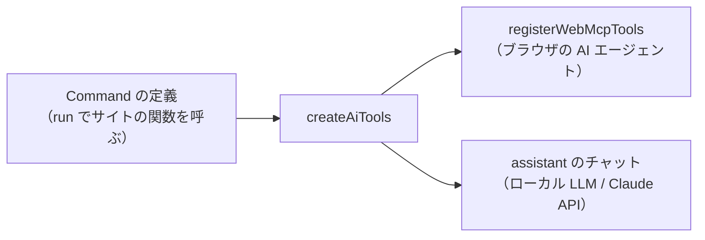

# AI 向けツールと WebMCP

Command の定義から AI 向けのツールを作り、WebMCP（ブラウザの AI エージェント）に登録する。サイト内のチャット（`@ai-friendly/assistant`）も同じツールを使う。Command そのものの仕様は [commands.md](commands.md)。



## 使い方

```ts
import { createAiTools } from "@ai-friendly/command";
import { registerWebMcpTools } from "@ai-friendly/command/webmcp";

const tools = createAiTools({
  commands: [addTodoCommand, deleteTodoCommand],
  confirm: (command, confirmation) =>
    window.confirm(confirmation?.title ?? `Run ${command.type}?`),
  getState: () => todos.map(({ id, title, done }) => ({ id, title, done })),
});

const controller = new AbortController();
const registered = await registerWebMcpTools(tools, { signal: controller.signal });
// 状態が変わってツールを作り直すとき・画面を離れるときに解除する
controller.abort();
```

## ツール（`createAiTools`）

`AiTool[]` を返す。

| ツール | 中身 |
| --- | --- |
| Command ごと（ツール名は Command の `type`） | Command を 1 つ実行する。`inputSchema` は `z.toJSONSchema(args, { io: "input" })`。確認が要る Command は説明の末尾に `[asks the user to confirm]` が付く |
| `get_state` | `getState()` の結果を返す。`readOnlyHint: true`。`getState` を渡したときだけ作る |

* 実行は「引数の検証 → 確認 → `run`」の順に進む（[commands.md](commands.md) の「実行の流れ」）
* 戻り値は `ExecuteResult`（`{ ok: true }` / `{ ok: true, message }` / `{ ok: false, code, message }`）
* `execute(input, { pointer })` の 2 つ目は、実行する側が渡すもの。サイト内のチャットはカーソル（`pointer`）を渡す（[commands.md](commands.md) の「押すふり・打ち込むふり」）
* `getState` は、AI が Command を組み立てるのに要る情報だけを返す（全部渡すとトークンが増える）
* Command の `type` を `get_state` にしない（ツール名がぶつかる）

## 短い一覧（`describeCommands`）

小さい LLM 向けに、JSON Schema の代わりに 1 Command 1 行で書く。システムプロンプトなどに使える。

* 今はどの題材・チャットも使っていない。チャットの Gemini Nano・WebLLM は、システムプロンプトにツールの名前と説明を 1 行ずつ書き、引数の形は返事の JSON Schema で縛っている（[assistant.md](assistant.md) の「JSON でツールを呼ぶ」）

```
add_todo(id: string, title: string, tags?: string[]) — Add a todo
delete_todo(id: string) — Delete a todo [may ask the user to confirm]
set_priority(id: string, level: "low"|"high", order?: integer, meta?: { note: string }) — Set priority
```

* 引数は zod の入力の型で書く。`?` は省略できる項目（`optional` / `default`）
* `requiresConfirmation` が `true` なら `[asks the user to confirm]`、関数なら `[may ask the user to confirm]`
* フィールドの `.describe()` は載せない（WebMCP の `inputSchema` には載る）

## WebMCP への登録（`@ai-friendly/command/webmcp`）

* `document.modelContext` を使い、なければ `navigator.modelContext`（Chromium 150 で deprecated）を使う
* WebMCP が使えないブラウザでは何もせず `false` を返す
* 解除は `signal` を abort する（WebMCP には `unregisterTool` がない）
* WebMCP は `execute` の 2 つ目に自分の client を渡すので、入力だけを渡すように包んで登録する
* 登録の途中で abort されたとき（React の StrictMode・ツールの作り直し）は、残りの登録をやめて `false` を返す。abort による失敗は投げない（abort 以外の失敗は投げる）
* WebMCP の仕様はまだ変わるため、登録まわりはこのサブパスに閉じ込めている
