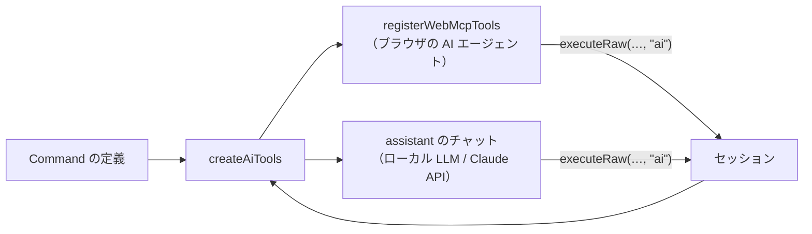

# AI 向けツールと WebMCP

Command の定義とセッションから AI 向けのツールを作り、WebMCP（ブラウザの AI エージェント）に登録する。サイト内のチャット（`@ai-friendly/assistant`）も同じツールを使う。Command そのものの仕様は [commands.md](commands.md)。



## 使い方

```ts
import { createAiTools } from "@ai-friendly/command";
import { registerWebMcpTools } from "@ai-friendly/command/webmcp";

const tools = createAiTools(session, {
  describeState: (state) => state.todos.map(({ id, title, done }) => ({ id, title, done })),
});

const controller = new AbortController();
const registered = await registerWebMcpTools(tools.all, { signal: controller.signal });
// 画面を離れるときなどに解除する
controller.abort();
```

## ツール（`createAiTools`）

| ツール | 中身 | 主な使い道 |
| --- | --- | --- |
| `tools.batch`（`execute_commands`） | 複数の Command を 1 バッチで実行する。説明に Command の短い一覧を載せる | チャット（小さいローカル LLM）・WebMCP |
| `tools.perCommand`（ツール名は Command の `type`） | Command を 1 つ実行する。`inputSchema` は `z.toJSONSchema(args, { io: "input" })` | WebMCP（引数の型を正確に伝える） |
| `tools.getState`（`get_state`） | `describeState(state)` の結果を返す。`readOnlyHint: true`。`describeState` を渡したときだけ作る | 両方（ID などを調べる） |
| `tools.all` | 上のすべて | `registerWebMcpTools` に渡す |

* どのツールも実行は `session.executeRaw(…, "ai")` を通る。確認フック・検証の英文のエラーがそのまま効く
* 戻り値は `ExecuteResult`（`{ ok: true }` / `{ ok: false, code, message }`）
* `execute_commands` の入力は `{"commands": [{ "type": "add_todo", ... }]}`。形が違えば `invalid_command` を返す
* `describeState` は、AI が Command を組み立てるのに要る情報だけを返す（全部渡すとトークンが増える）
* Command の `type` を `execute_commands` / `get_state` にしない（ツール名がぶつかる）

## 短い一覧（`describeCommands`）

小さい LLM 向けに、JSON Schema の代わりに 1 Command 1 行で書く。`execute_commands` の説明に使う。

```
add_todo(id: string, title: string, tags?: string[]) — Add a todo
delete_todo(id: string) — Delete a todo [may ask the user to confirm]
set_priority(id: string, level: "low"|"high", order?: integer, meta?: { note: string }) — Set priority
```

* 引数は zod の入力の型で書く。`?` は省略できる項目（`optional` / `default`）
* `requiresConfirmation` が `true` なら `[asks the user to confirm]`、関数なら `[may ask the user to confirm]`
* フィールドの `.describe()` は載せない（WebMCP の `inputSchema` には載る）

## WebMCP への登録（`@ai-friendly/command/webmcp`）

* `document.modelContext` を使い、なければ `navigator.modelContext`（Chromium 150 で deprecated）を使う
* WebMCP が使えないブラウザでは何もせず `false` を返す
* 解除は `signal` を abort する（WebMCP には `unregisterTool` がない）
* WebMCP の仕様はまだ変わるため、登録まわりはこのサブパスに閉じ込めている
