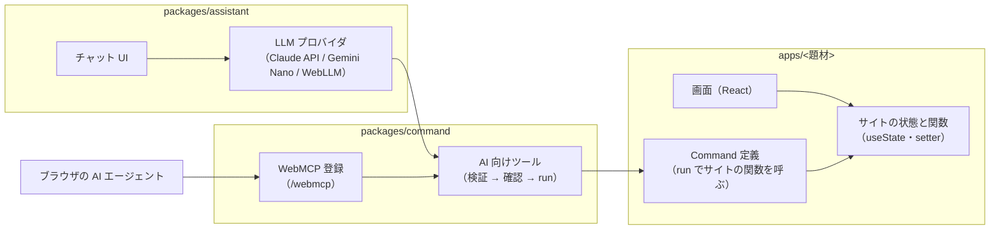

# アーキテクチャ

## 全体像

## package

| package | 責務 | 依存 |
| --- | --- | --- |
| `packages/command` | Command 定義の型（`run` でサイトの関数を呼ぶ）・引数の検証（LLM が読める英文のエラー）・確認フック。仕様は [commands.md](commands.md) AI 向けツール（Command ごと・`get_state`）と WebMCP への登録（`@ai-friendly/command/webmcp`）。仕様は [ai-tools.md](ai-tools.md) | zod のみ（React / LLM に依存しない） |
| `packages/assistant` | サイト内の AI チャット：チャット UI（`FloatingChat`）・会話のループ・LLM プロバイダ（Claude API・Chrome の Gemini Nano・WebLLM の Qwen。入力欄で切り替える）。仕様は [assistant.md](assistant.md) | `packages/command`, `packages/ui` |
| `packages/ui` | 共通 UI：shadcn/ui の部品と Tailwind v4 の配色トークン（`theme.css`）。使い方は [ui.md](ui.md) | なし（React は peer） |
| `apps/<題材>` | 普通のサイト（状態・画面）と、そのサイトの関数を包む Command 定義 | `packages/command`, `packages/assistant`, `packages/ui` |

* `command` は単体でも成立させる。チャットを使わず WebMCP だけで操作される場合も、`command` だけで AI から操作できる
* チャット（`assistant`）と WebMCP は同じツールを使い、どちらも「引数の検証 → 確認 → `run`」を通る
* 状態の永続化は localStorage

## 未定

* 題材（複数用意する）
* i18n の実装方法
