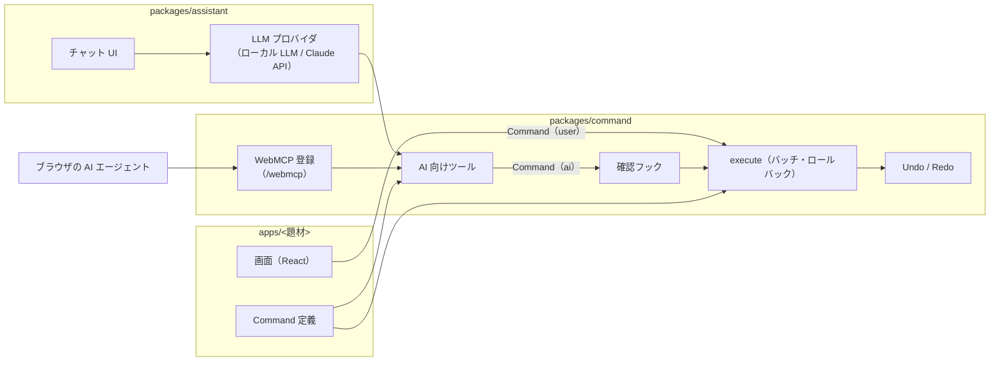

# アーキテクチャ

## 全体像

## package

| package | 責務 | 依存 |
| --- | --- | --- |
| `packages/command` | Command 定義の型・execute・Undo/Redo（スナップショット方式）・検証（LLM が読める英文のエラー）・発行元・確認フック・購読。仕様は [commands.md](commands.md) AI 向けツール（`execute_commands`・Command ごと・`get_state`）と WebMCP への登録（`@ai-friendly/command/webmcp`）。仕様は [ai-tools.md](ai-tools.md) | zod のみ（React / LLM に依存しない） |
| `packages/assistant` | サイト内の AI チャット：チャット UI・LLM プロバイダの切り替え（ローカル LLM / Claude API など） | `packages/command` |
| `apps/<題材>` | 題材ごとの状態・Command 定義・画面 | `packages/command`, `packages/assistant` |

* `command` は単体でも成立させる。チャットを使わず WebMCP だけで操作される場合も、`command` だけで AI から操作できる
* チャット（`assistant`）と WebMCP は同じツールを使い、どちらも `executeRaw(…, "ai")` を通る
* 状態の永続化は localStorage

## 未定

* 題材（複数用意する）
* i18n の実装方法
* ローカル LLM の実行方法
