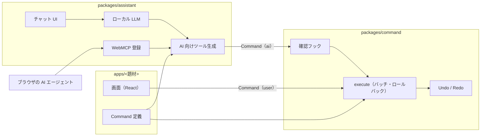

# アーキテクチャ

## 全体像

## package

| package | 責務 | 依存 |
| --- | --- | --- |
| `packages/command` | Command 定義の型・execute・Undo/Redo・検証（LLM が読める英文のエラー）・発行元・確認フック | なし（React / LLM に依存しない） |
| `packages/assistant` | Command 定義から短い一覧の説明を生成・WebMCP への登録・ローカル LLM・チャット UI | `packages/command` |
| `apps/<題材>` | 題材ごとの状態・Command 定義・画面 | `packages/command`, `packages/assistant` |

* `command` は単体でも成立させる。チャットを使わず WebMCP だけで操作される場合も同じ Command を通る
* 状態の永続化は localStorage

## 未定

* 題材（複数用意する）
* i18n の実装方法
* ローカル LLM の実行方法
