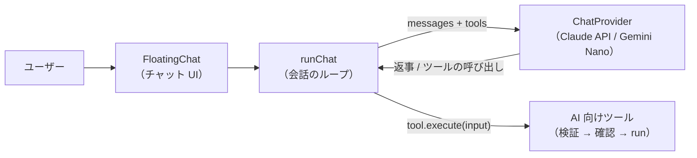

# サイト内の AI チャット（`@ai-friendly/assistant`）

AI 向けツール（[ai-tools.md](ai-tools.md) の `createAiTools`）を使って、サイトをチャットから操作する。チャットの裏で動く LLM はプロバイダとして差し替える。



## 使い方

```tsx
import { ApiKeyForm, createClaudeProvider, FloatingChat, useGeminiNano } from "@ai-friendly/assistant";

const claude = apiKey ? createClaudeProvider({ apiKey, system }) : undefined;
const geminiNano = useGeminiNano({ system, language }); // { label, provider?, setup }

<FloatingChat
  providers={[
    // 入力欄の左下で切り替える。最初は先頭。provider がないときは setup を出す
    { label: "Claude", provider: claude, setup: <ApiKeyForm language={language} onSubmit={setApiKey} /> },
    geminiNano,
  ]}
  actions={apiKey && <Button onClick={() => setApiKey(null)}>キーを変更</Button>} // パネルの見出しの右
  tools={tools} // createAiTools の結果
  language={language} // "ja" | "en"。チャットの文言の言語
  suggestions={["ダークにして", "英語にして"]} // 何も話していないときに出す例
  debug={import.meta.env.DEV} // 失敗の理由に LLM 向けの英文も出す（開発中だけなど）
/>;
```

アプリの CSS で、Tailwind に assistant のクラスを拾わせる:

```css
@source "../../../packages/assistant/src";
```

## 会話のループ（`runChat`）

1. プロバイダに会話（`messages`）とツール（`tools`）を渡す
2. 返事にツールの呼び出し（`toolCalls`）があれば、ツールを実行し、結果を `tool` メッセージとして会話に足す
3. ツールの呼び出しがなくなるまで 1〜2 を繰り返す。上限は 5 ステップ（超えたら止めて知らせる）

* `provider` と `tools` は、ステップごとに最新を読む。React では、状態が変わるとツール（`get_state` など）が作り直されるため
* ツールの呼び出しの `id` は、会話の中で一意にする（プロバイダの責任。画面はこの `id` で結果を探す）
* 知らないツールを呼んだときは、使えるツールを添えた英文のエラーを結果として返す（LLM が自分で直せるように）

```ts
type ChatMessage =
  | { role: "user"; content: string }
  | { role: "assistant"; content: string; toolCalls?: ToolCall[] }
  | { role: "tool"; toolCallId: string; result: unknown };

type ChatProvider = {
  complete(request: { messages: ChatMessage[]; tools: AiTool[] }): Promise<{ content: string; toolCalls?: ToolCall[] }>;
};
```

## プロバイダ

| プロバイダ | 内容 |
| --- | --- |
| `createClaudeProvider({ apiKey, model?, system? })` | ブラウザから Claude API（Messages API）を直接呼ぶ。`fetch` だけで、ライブラリは使わない。既定のモデルは `claude-haiku-4-5` |
| `createGeminiNanoProvider({ system? })` | Chrome に入っている Gemini Nano（Prompt API・`LanguageModel`）を使う。API キーもサーバーも要らない。ふつうは `useGeminiNano` から使う |

### Claude API

* ヘッダーは `x-api-key`・`anthropic-version: 2023-06-01`・`anthropic-dangerous-direct-browser-access: true`（ブラウザから直接呼ぶための許可）
* 会話の変換: `assistant` は `text` と `tool_use`、続く `tool` は 1 つの user メッセージの `tool_result` にまとめる（失敗は `is_error: true`）。user が続いたら 1 つにまとめる
* API キーが正しくない（401）ときは `ProviderAuthError` を投げ、チャットは「API キーが正しくありません」と知らせる
* サーバーを通さないため、利用者自身の API キーを使う前提。キーの持ち方はアプリが決める（settings サイトは state に持つだけで保存しない）

### Gemini Nano（Prompt API）

* パソコン版の Chrome 148 以降で、端末の条件（メモリ 16 GB など）を満たすときだけ使える
* Prompt API にはツールを呼ぶ仕組みがないため、返事の形を JSON Schema（`responseConstraint`）で決める

  ```json
  { "calls": [{ "name": "set_theme", "input": { "theme": "dark" } }], "reply": "" }
  ```

  * `calls` の要素は、ツールごとに `name` と `input`（そのツールの `inputSchema`）を `anyOf` で並べる。存在しないツール・形の違う引数は出せない
  * 受け取った `calls` に `id`（`crypto.randomUUID()`）を付けて `toolCalls` にする
* システムプロンプトには、サイトの `system` に、ツールの一覧（名前と説明を 1 行ずつ）と返事の形の説明を足す（小さいモデル向け）
* 会話の変換: `assistant` は上の JSON の文字列、`tool` の結果は user の発言（`Result of set_theme: {"ok":true}`）。同じ役が続いたら 1 つにまとめる
* 返事のたびにセッションを作り、終わったら `destroy()` する（会話は毎回まるごと渡ってくるので持ち越さない）
* 言語は `expectedInputs` / `expectedOutputs` に `["en", "ja"]` を渡す

`useGeminiNano({ system, language })` は、`providers` に入れる候補（`{ label: "Gemini Nano", provider?, setup }`）を返す。

| `LanguageModel.availability()` | 出すもの |
| --- | --- |
| `"available"` | `provider`（そのまま話せる） |
| `"downloadable"` / `"downloading"` | `setup` に「モデルをダウンロード」。押すと `create()` の `monitor` で進み具合（%）を出し、終わったら `provider` を返す |
| `"unavailable"`・`LanguageModel` がない | `setup` に「このブラウザでは使えません」 |

* ダウンロードはユーザーが押したときだけ。失敗したら知らせて、もう一度押せるようにする

### 切り替え

* `providers` に候補（`ProviderOption`: `{ label, provider?, setup? }`）を並べる。2 つ以上あると、入力欄の左下（`setup` を出している間はその下）に、選んでいる候補の名前のボタンを出し、押すと一覧から選べる
* どれを選んでいるかはチャットが持つ。最初は先頭で、保存はしない
* 切り替えても会話は続く。次の返事から新しい LLM が答える
* WebLLM（Qwen）は #32

## 画面

| 部品 | 内容 |
| --- | --- |
| `Chat` | メッセージの一覧と入力欄。会話の状態を自分で持ち、単体で使える（`<Chat providers tools language />`）。置き場所に依存しないので、ページの中・ドロワーなどにも入れられる。選んでいる候補に `provider` がないときは `setup` を出す |
| `ApiKeyForm` | Claude の API キーを入れるフォーム。`setup` に置く |
| `useGeminiNano` | Gemini Nano の候補（ダウンロード・使えないときの表示を含む）を返す |
| `FloatingChat` | `Chat` を右下のボタンから開く浮いたパネルに入れる。スマホでは画面いっぱいに開く。閉じてもパネルは隠すだけなので、会話は残る。見出しの右に `actions` を置ける |
| `ToolCallLine` | ツールの実行の既定の見せ方。`✓ set_theme(theme: "dark")` のブロックで、実行中は灰、成功は黄、失敗は赤の地。失敗は「やめました」（確認で拒否）/「実行できませんでした」と出し、`debug` のときは LLM 向けの英文のメッセージも出す。`renderToolCall` で差し替えられる（`ToolCallLineProps` を受け取る） |

### ファイルの構成

```
src/
  chat/chat.tsx              # Chat: 会話の状態（useChat）と ui の部品を組み立てる
  layouts/floating-chat.tsx  # FloatingChat: Chat を右下のパネルに入れる
  ui/                        # 見た目だけの部品。props だけで描画し、会話の状態や i18n を知らない
  conversation/              # 会話の状態（useChat）とループ（runChat）。画面なし
  providers/                 # プロバイダの型・Claude API・Gemini Nano（useGeminiNano）
  i18n/                      # チャットの文言（ja / en）
```

* 開くと入力欄（なければ `setup` の最初の入力・ボタン）にフォーカスし、Esc か × で閉じてボタンにフォーカスを戻す。切り替えの一覧を閉じる Esc ではパネルは閉じない
* 話しかけ方の例を押すと、例は消えるので入力欄にフォーカスを移す
* Enter で送信、Shift+Enter で改行。日本語の変換を確定する Enter では送らない
* 実行中は「考えています…」を出し、送信できない
* 返事を受け取れなかった・API キーが正しくない・ステップ数の上限で止めた、は会話の流れの中にお知らせとして残す（LLM には送らない）
* キーを保存した・「キーを変更」を押した・LLM を切り替えた・モデルのダウンロードが終わった、で入力欄が入れ替わるので、新しい入力欄にフォーカスを移す
* 確認が要る Command は、アプリが `createAiTools` に渡した `confirm` で確認する（チャット内の確認は #10）

## 文言

チャットの文言は assistant が ja / en で持つ。`language` にサイトの言語を渡す。話しかけ方の例（`suggestions`）はサイトごとに違うので、サイトが自分の i18n で渡す。
