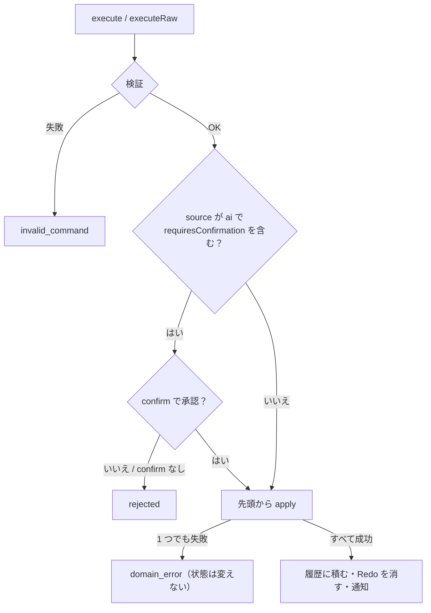

# Command 基盤（`@ai-friendly/command`）

状態を変更する唯一の入口。画面の操作・AI チャット・WebMCP はすべてここを通す。React / LLM には依存しない。

## 使い方

```ts
import { createCommandSession, defineCommand } from "@ai-friendly/command";

const addTodo = defineCommand({
  type: "add_todo",
  description: "Add a todo",
  args: {
    type: "object",
    properties: { id: { type: "string" }, title: { type: "string" } },
    required: ["id", "title"],
  },
  apply(state: TodoState, args) {
    // args は { id: string; title: string } に推論される
    return { ok: true, state: { todos: [...state.todos, { ...args, done: false }] } };
  },
});

const session = createCommandSession({
  initialState: { todos: [] },
  commands: [addTodo, deleteTodo],
  confirm: (commands) => window.confirm(`AI wants to run ${commands.length} commands`),
});

await session.execute({ type: "add_todo", id: crypto.randomUUID(), title: "Buy milk" });
await session.executeRaw(jsonFromLlm, "ai");
```

## Command の定義（`defineCommand`）

| 項目 | 内容 |
| --- | --- |
| `type` | Command 名。snake_case の動詞始まり（`add_todo`） |
| `description` | 何をするか（英文）。AI 向けのツール説明に使う |
| `args` | 引数の定義（下の「引数の書き方」） |
| `requiresConfirmation` | `true` なら、AI が実行するときに確認フックで承認を得る |
| `apply(state, args)` | 新しい状態を `{ ok: true, state }` で返す。ドメイン上のエラー（存在しない ID など）は `{ ok: false, message }` で返す。`state` は書き換えず、新しいオブジェクトを返す |

* ID は Command を発行する側で決める（`apply` の中で生成しない）。同じ Command 列なら同じ状態になるようにするため

### 引数の書き方

JSON Schema のサブセット。同じ定義を、検証・WebMCP の `inputSchema`・AI 向けの短い一覧に使う。

| `type` | 追加の項目 | TS の型 |
| --- | --- | --- |
| `string` | `enum?` | `string`（`enum` があればその union） |
| `number` | | `number`（`NaN` / `Infinity` は不可） |
| `integer` | | `number`（整数のみ） |
| `boolean` | | `boolean` |
| `array` | `items` | 要素の型の配列 |
| `object` | `properties`, `required?` | `required` にない項目は省略可 |

* どれにも `description?` を書ける
* Command の `args` 自体は `object`。Command は `{ type, ...args }` の平らな形で渡す

## セッション（`createCommandSession`）

| メソッド | 内容 |
| --- | --- |
| `execute(commands, source = "user")` | 定義済みの Command だけを受け取る（型で検査）。戻り値は `Promise<ExecuteResult>` |
| `executeRaw(input, source)` | 型の分からない入力（LLM の JSON など）を受け取る。検証は `execute` と同じ |
| `undo()` / `redo()` | バッチ単位で戻す / やり直す |
| `canUndo()` / `canRedo()` | 戻せるか / やり直せるか |
| `getState()` | 今の状態。変わらない限り同じ参照を返す |
| `getHistory()` | 実行したバッチ（`{ commands, source }`）の一覧。Undo したものは含まない |
| `subscribe(listener)` | 状態が変わったら呼ぶ。戻り値は解除する関数（`useSyncExternalStore` で使える） |

## 実行の流れ



* Command 1 つでも配列でもよい。配列は 1 バッチとして扱い、Undo 1 回で戻る。空の配列はエラー
* バッチの途中で失敗したら、状態は実行前のまま変えない
* 確認はバッチにつき 1 回。検証は確認の前に済ませる
* `apply` は確認の後に、その時点の状態に対して行う

## 結果とエラー

```ts
type ExecuteResult = { ok: true } | { ok: false; code: ErrorCode; message: string };
```

| `code` | いつ | `message` の例 |
| --- | --- | --- |
| `invalid_command` | 形が違う | `commands[1]: unknown command "add_itme" (available: add_todo, delete_todo)` |
| | | `commands[0]: unknown field "name" in add_todo (fields: id, title)` |
| | | `commands[0]: missing required field "title" in add_todo` |
| | | `commands[0].tags[1]: expected string, got null` |
| | | `commands[0].level: expected one of "low", "high", got "mid"` |
| `domain_error` | `apply` が失敗した | `commands[1] (add_todo): todo "1" already exists` |
| `rejected` | 確認で拒否された / `confirm` がない | `commands: rejected by the user` |
| `nothing_to_undo` / `nothing_to_redo` | 戻せる / やり直せる履歴がない | `nothing to undo` |

* `message` は LLM が読んで自分で直せるよう、英文で「何番目の何が違うか」を書く
