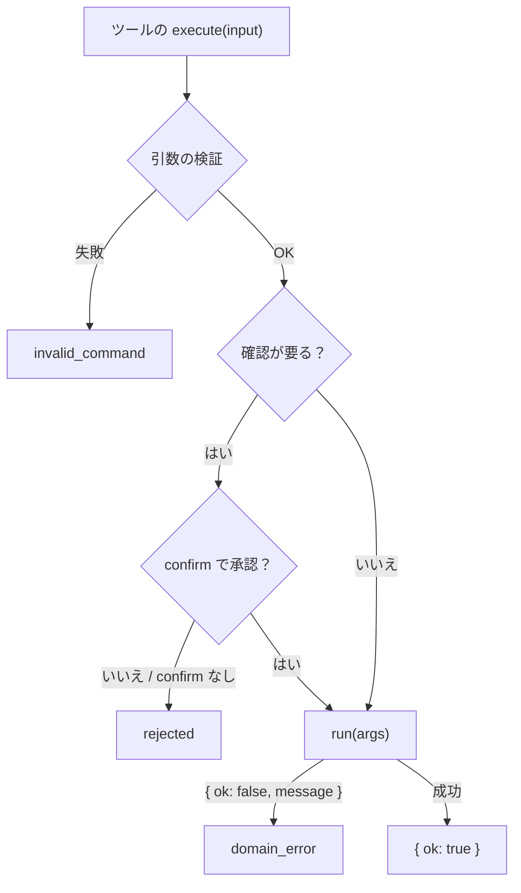

# Command 基盤（`@ai-friendly/command`）

サイトの関数（`setLanguage` など）を、AI が安全に呼べるツールにする。React / LLM には依存しない。

* サイトは普通に作る。AI から操作したいものだけ、Command としてサイトの関数を包む
* AI からの入力は、引数の検証（zod・LLM が読んで直せる英文のエラー）と、必要なら確認を通ってから `run` に届く
* AI 向けツールの作り方と WebMCP への登録は [ai-tools.md](ai-tools.md)

## 使い方

```ts
import { createAiTools, defineCommand } from "@ai-friendly/command";
import { registerWebMcpTools } from "@ai-friendly/command/webmcp";
import { z } from "zod";

const setLanguageCommand = defineCommand({
  type: "set_language",
  description: "Change the display language.",
  args: z.object({ language: z.enum(["ja", "en"]) }),
  run: ({ language }) => setLanguage(language), // サイトの関数を呼ぶ
});

const resetSettingsCommand = defineCommand({
  type: "reset_settings",
  description: "Reset the theme and language to the defaults.",
  args: z.object({}),
  requiresConfirmation: true,
  run: () => resetSettings(),
});

const tools = createAiTools({
  commands: [setLanguageCommand, resetSettingsCommand],
  confirm: (command) => window.confirm(`Run ${command.type}?`),
  getState: () => ({ theme, language }),
});
await registerWebMcpTools(tools, { signal });
```

React では、状態が変わるたびに Command とツールを作り直す（`run` や `requiresConfirmation` が今の状態と setter を使えるように）。WebMCP には `signal` で前の登録を外してから登録し直す。

## Command の定義（`defineCommand`）

| 項目 | 内容 |
| --- | --- |
| `type` | Command 名。snake_case の動詞始まり（`add_todo`）。そのまま AI 向けのツール名になる |
| `description` | 何をするか（英文）。AI 向けのツールの説明に使う |
| `args` | 引数の定義（下の「引数の書き方」） |
| `requiresConfirmation` | 実行の前に確認フックで承認を得るか。`true` / `false`、または `(args) => boolean` |
| `run(args)` | サイトの関数を呼ぶ。`args` は検証済み。成功なら何も返さない。ドメイン上のエラー（存在しない ID など）は `{ ok: false, message }` を返す。Promise でもよい |

* `message` は LLM が読んで直せる英文にする（`todo "1" not found`）

### 条件付きの確認

```ts
const deleteTodoCommand = defineCommand({
  type: "delete_todo",
  // ...
  // 未完了の TODO を消すときだけ確認する（todos は今の状態）
  requiresConfirmation: ({ id }) => !todos.find((t) => t.id === id)?.done,
  run: ({ id }) => deleteTodo(id),
});
```

* 状態を見て判定するときは、Command を作るときに今の状態を閉じ込める
* 確認するかを LLM に決めさせない。確認は AI の間違いへの守りなので、条件はコードで決める

### 引数の書き方

zod（v4）のオブジェクトで書く。同じ定義を、検証・WebMCP の `inputSchema`（`z.toJSONSchema(args, { io: "input" })`。`default` のある項目を必須にしないため入力側で出す）・AI 向けの短い一覧に使う。

```ts
args: z.object({
  id: z.string(),
  title: z.string().describe("Shown in the list"),
  tags: z.array(z.string()).optional(),
  priority: z.enum(["low", "high"]).default("low"),
}),
```

* `run` の `args` は検証後の値（zod の出力の型）。`default` などはここで反映される
* 一番外側は定義にないフィールドをエラーにする（`.strict()` で検証する）。入れ子の `z.object` で同じようにしたいときは `z.strictObject` を使う
* `.describe()` の説明は WebMCP の `inputSchema` に載る
* 引数のない Command は `args: z.object({})` と書く

## 実行の流れ

AI 向けツールの `execute(input)` は次の順に進む。



* 検証は確認の前に済ませる
* 確認の画面（ダイアログ・チャット内での確認など）はアプリが `confirm` で決める。`confirm` には `{ type, ...args }` が渡る

## 結果とエラー

```ts
type ExecuteResult = { ok: true } | { ok: false; code: ErrorCode; message: string };
```

| `code` | いつ | `message` の例 |
| --- | --- | --- |
| `invalid_command` | 引数の形が違う | `input: unknown field "name" in add_todo (fields: id, title)` |
| | | `input: missing required field "title" in add_todo` |
| | | `input.tags[1]: Invalid input: expected string, received null` |
| | | `input.level: Invalid option: expected one of "low"\|"high"` |
| `rejected` | 確認で拒否された / `confirm` がない | `delete_todo: rejected by the user` |
| `domain_error` | `run` が失敗を返した | `add_todo: todo "1" already exists` |

* `message` は LLM が読んで自分で直せるよう、英文で「どこの何が違うか」を書く
* 型の違いなどは zod のメッセージに場所（`input.title`）を付けて返す。未定義のフィールド・必須項目の欠けは、使えるフィールドを添えた独自の英文にする

## 持たないもの

* **バッチ**（複数の Command をまとめて実行・全部か何もしないか）と **Undo / Redo**: 工夫の 1 つで、なくても成り立つ。要るサイトは外側に足す（[docs/history/2026-10-06-minimal-command.md](history/2026-10-06-minimal-command.md)）
* **状態**: 状態はサイトが持つ。Command はサイトの関数を呼ぶだけ
